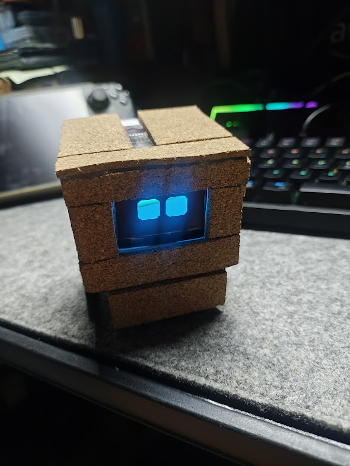
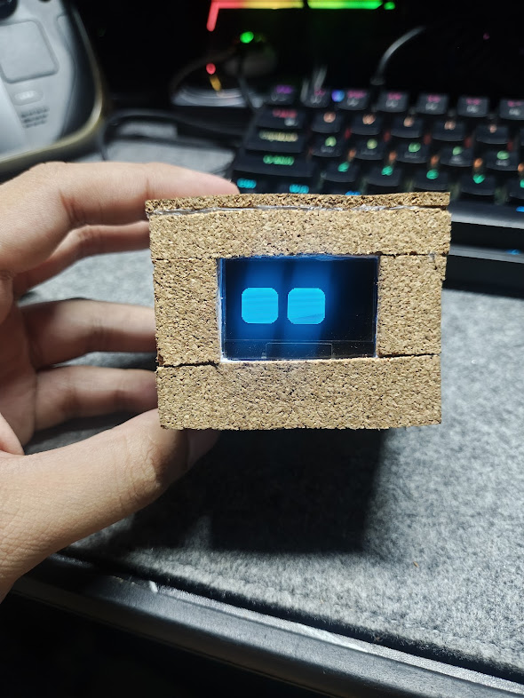
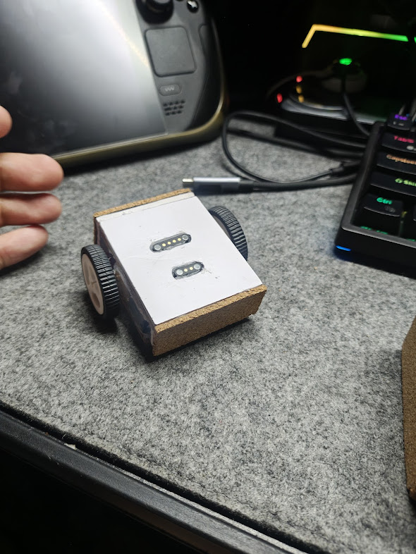

# DeskDroid

> A compact, autonomous ESP32-S3 desktop companion robot featuring expressive OLED eyes, environmental telemetry, capacitive gesture controls, and a local web dashboard interface.




## Preview

This build uses PVC boards and Cork Sheets for the chassis, and pogo pin magnets for split chassis connectivity between the standalone base and the motor chassis.
| Stacks | Preview |
| :--- | :--- |
| Standalone Base |  |
| Motor Chassis |  |

## Key Features
- Expressive Eye Animations: Dynamic emotional states (Happy, Angry, Confused, Sweating, Tired) powered by FluxGarage_RoboEyes on a 1.3" OLED display.
- Interactive Touch Gestures: Single-point capacitive touch interface supporting multi-tier hold duration triggers (Happy reaction, Angry reaction, Dashboard overlay, and Deep Sleep power management).
- Local Web Dashboard & Remote Control: Built-in HTTP server hosting a responsive dashboard to drive locomotion, force emotional states, toggle military/standard time, view live sensor telemetry, and read streaming serial logs.
- Environmental & Motion Awareness:
  - ADXL345 Accelerometer: High-G shake detection and physics reaction loops.
  - TEMT600 Light Sensor: Ambient light detection for automatic screen dimming and night sleep mode.
  - OpenWeather API & NTP Synchronization: Automatic location, weather condition, temperature, humidity, and clock updates via Wi-Fi.
- Autonomous and Manual Navigation: Idle motion loops and manual navigation through the web dashboard when connected to the optional motor chassis.

## Parts and Dependencies

### 💿 Software
1. **Development Environment:** [Visual Studio Code](https://code.visualstudio.com/) with [PlatformIO](https://platformio.org/) Extension installed.
2. **Core Libraries:** (as seen in [lib/README.md](lib/README.md)):
    - Adafruit_GFX & Adafruit_SH110X (Display Driver)
    - Adafruit_ADXL345_U & Adafruit_Sensor (Accelerometer)
    - FluxGarage_RoboEyes (Eye Animations)
    - CuteBuzzerSounds (Audio Effects)
    - WiFiManager (Captive Portal Provisioning)
    - ArduinoJson (Web Telemetry Parsing)
3. **Cloud Services:** [OpenWeather API Key](https://openweathermap.org/api) (Free Tier)

### ⚙️ Hardware

| Category | Component | Specification |
| :--- | :--- | :--- |
| **Microcontroller** | ESP32-S3 SuperMini | Dual-core 240MHz, 2.4GHz Wi-Fi |
| **Display** | 1.3" OLED Display | SH1106G I2C (128x64 resolution) |
| **Sensors** | TEMT600 | Ambient Light Sensor |
| | ADXL345 | 3-Axis Digital Accelerometer |
| | TTP223 | Capacitive Touch Module |
| **Actuators** | G12 N20 DC Motors (Right Angled) | Dual Gear Motors w/ L9110S Driver |
| | Piezo Buzzer | Passive Buzzer for audio cues |
| **Power** | 3.7V LiPo Battery | Single-cell rechargeable battery |

## Project Structure
```
desk-droid/
├── fritzing/              # Circuit schematics and component models
│   ├── parts/             # Custom Fritzing component definitions
│   └── desk-droid.fzz     # Main project circuit schematic
├── include/               # System C++ header interfaces
│   ├── audio_system.h     # Audio player & buzzer API header
│   ├── config.h           # Hardware pinout & system threshold constants
│   ├── display_ui.h       # OLED screen & dashboard drawer functions
│   ├── motors.h           # L9110S motor direction state declarations
│   ├── network_system.h   # Web server, telemetry & API endpoints
│   └── power_system.h     # Power telemetry & deep sleep interface
├── lib/                   # Project dependencies & vendor libraries
│   ├── CuteBuzzerSounds/  # Passive buzzer sound effects library
│   └── RoboEyes/          # FluxGarage RoboEyes display animation engine
├── src/                   # Core software implementation
│   ├── audio_system.cpp   # Audio hardware routines
│   ├── dashboard.html     # Single-file Web UI dashboard (HTML/CSS/JS)
│   ├── display_ui.cpp     # OLED UI graphics rendering engine
│   ├── main.cpp           # Main lifecycle setup(), loop() & event handlers
│   ├── motors.cpp         # L9110S motor driver hardware implementations
│   ├── network_system.cpp # Web server routes & OpenWeather API fetchers
│   └── power_system.cpp   # Power telemetry & deep sleep implementation
├── platformio.ini         # PlatformIO build environment configuration
├── secrets.ini            # Private credentials file (Git ignored)
└── secrets.ini.example    # Configuration template for secrets
```

Note: `README.md` files in each directory for further details.

## Usage

### 🤖 Schematics
Follow the schematics as seen in [fritzing/desk-droid.fzz](fritzing/desk-droid.fzz). Use [Fritzing](https://fritzing.org/) and follow the instructions at [fritzing/README.md](fritzing/README.md) to import the parts.

### 🌐 Code: Building & Uploading
1. Clone the repository and open in VScode with PlatformIO extension installed.
2. Import the PlatformIO libraries listed in [lib/README.md](lib/README.md).
3. Create a `secrets.ini` file using [secrets.ini.example](secrets.ini.example) as reference, and place your [OpenWeather API key](https://openweathermap.org/api).
    ```ini
    [secrets]
    OPENWEATHER_API_KEY = your_openweather_api_key_here
    ```
4. Connect the microcontroller and select the proper port.
5. **Build** then **Upload** the project.

### 🛜 Initial Wi-Fi Setup
On first boot (or if saved Wi-Fi is unavailable), DeskDroid will create a Wi-Fi Access Point named Desk-Droid-Setup. Connect to this network on your smartphone or PC to enter your local Wi-Fi credentials via the captive portal. Once connected, DeskDroid will acquire an IP address and display it on-screen.

### 🎮 Interactive Controls & Touch Gestures

DeskDroid uses time-based hold durations on the **TTP223 Touch Sensor** to navigate modes:

| Duration | Action | Response |
| :--- | :--- | :--- |
| **0.3s – 0.9s** | Short Tap | **Happy Reaction:** Laugh animation, sound effect, and brief forward scoot. |
| **1.0s – 1.8s** | Medium Hold | **Angry Reaction:** Angry eyes, sound effect, and brief backward scoot. |
| **1.8s** | Long Hold | **Dashboard Toggle:** Opens environmental metrics & system status overlay. |
| **3.0s+** | Sustained Press | **Deep Sleep:** Plays shutdown chime, powers off OLED, and enters low-power sleep. |

### 🌐 Web Dashboard
Access the DeskDroid web control interface by navigating to http://<DROID_IP_ADDRESS> in any web browser. The following API endpoints are also available:
- /drive?dir=[forward|backward|left|right|stop]: Manual drive overrides.
- /emotion?type=[happy|angry|confused|sweat|default]: Force specific emotional animations.
- /telemetry: Fetches JSON data for battery, weather, location, time, and system states.
- /serial_data: Real-time web terminal stream for debugging logs without a USB connection.

## 🤖 AI Usage & Transparency Disclaimer
This repository was developed with assistance from Large Language Model (LLM) AI tools acting as a collaborative coding partner.
- Code Refactoring & Optimization: AI was used for low-level I2C multiplexing routines, non-blocking timer loops, and debugging embedded power/brownout issues.
- Documentation & Web Assets: Project documentation, README.md structural formatting, and initial HTML/CSS dashboard layouts were generated or refined using AI prompts.
- Hardware Validation: All electronic circuits, PCB component choices, physical pin allocations, and assembly were manually constructed, tested, and verified on physical hardware by the author.

---

*DeskDroid: Made by Pau, or Anne*